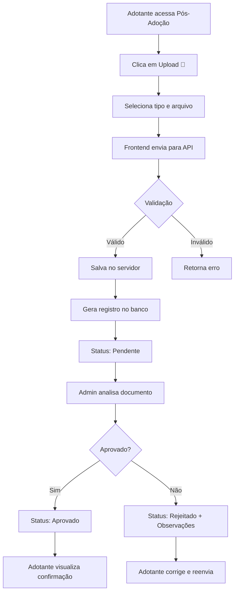

# 📁 Sistema de Documentos - Acompanhamento Pós-Adoção

## 🎯 Visão Geral

Sistema completo de upload, armazenamento e gerenciamento de documentos para acompanhamento pós-adoção, com banco de dados e API REST.

---

## 🗄️ Banco de Dados

### Estrutura de Documento

```typescript
interface Documento {
  id: string;                    // ID único do documento
  tipo: string;                  // Tipo do documento (ver tipos abaixo)
  nome: string;                  // Nome original do arquivo
  nomeArquivo: string;           // Nome do arquivo no servidor
  caminho: string;               // Caminho completo no servidor
  url: string;                   // URL para download
  tamanho: number;               // Tamanho em bytes
  mimeType: string;              // Tipo MIME (image/jpeg, application/pdf, etc.)
  dataUpload: string;            // Data/hora do upload (ISO 8601)
  adotanteId: string;            // ID do adotante
  animalId: string;              // ID do animal
  adocaoId?: string;             // ID da adoção (opcional)
  status: 'pendente' | 'aprovado' | 'rejeitado';  // Status do documento
  observacoes?: string;          // Observações da análise
}
```

### Tipos de Documentos

- `termo_adocao` - Termo de Adoção assinado
- `atestado_veterinario` - Atestado Veterinário
- `foto_animal` - Foto do Animal
- `comprovante_vacina` - Comprovante de Vacinação
- `relatorio_visita` - Relatório de Visita
- `outro` - Outros documentos

---

## 🔌 API Endpoints

### Base URL
```
http://localhost:3001/api/documentos
```

### 1. Listar Documentos

**GET** `/api/documentos`

Query Parameters:
- `adotanteId` (opcional) - Filtrar por adotante
- `animalId` (opcional) - Filtrar por animal
- `status` (opcional) - Filtrar por status

**Resposta:**
```json
[
  {
    "id": "1234567890",
    "tipo": "termo_adocao",
    "nome": "termo_assinado.pdf",
    "nomeArquivo": "termo_assinado-1234567890-123456789.pdf",
    "url": "/api/documentos/download/termo_assinado-1234567890-123456789.pdf",
    "tamanho": 245678,
    "mimeType": "application/pdf",
    "dataUpload": "2025-12-26T20:30:00.000Z",
    "adotanteId": "1",
    "animalId": "1",
    "status": "aprovado"
  }
]
```

---

### 2. Buscar Documento por ID

**GET** `/api/documentos/:id`

**Resposta:**
```json
{
  "id": "1234567890",
  "tipo": "atestado_veterinario",
  "nome": "atestado.pdf",
  ...
}
```

---

### 3. Upload de Documento

**POST** `/api/documentos/upload`

**Content-Type:** `multipart/form-data`

**Body:**
```
file: <arquivo> (obrigatório)
tipo: termo_adocao | atestado_veterinario | foto_animal | comprovante_vacina | relatorio_visita | outro
adotanteId: string (obrigatório)
animalId: string (obrigatório)
adocaoId: string (opcional)
```

**Exemplo usando FormData (JavaScript):**
```javascript
const formData = new FormData();
formData.append('file', fileInput.files[0]);
formData.append('tipo', 'termo_adocao');
formData.append('adotanteId', '1');
formData.append('animalId', '1');

const response = await fetch('http://localhost:3001/api/documentos/upload', {
  method: 'POST',
  body: formData
});
```

**Resposta (201):**
```json
{
  "message": "Documento enviado com sucesso",
  "documento": {
    "id": "1234567890",
    "tipo": "termo_adocao",
    "nome": "termo.pdf",
    ...
  }
}
```

**Tipos de arquivo aceitos:**
- Imagens: JPG, JPEG, PNG
- Documentos: PDF, DOC, DOCX
- Tamanho máximo: 10MB

---

### 4. Download de Documento

**GET** `/api/documentos/download/:filename`

Retorna o arquivo para download.

---

### 5. Atualizar Status

**PUT** `/api/documentos/:id/status`

**Body:**
```json
{
  "status": "aprovado",
  "observacoes": "Documento aprovado conforme checklist"
}
```

Status válidos: `pendente`, `aprovado`, `rejeitado`

**Resposta:**
```json
{
  "message": "Status atualizado com sucesso",
  "documento": {
    "id": "1234567890",
    "status": "aprovado",
    "observacoes": "Documento aprovado conforme checklist",
    ...
  }
}
```

---

### 6. Remover Documento

**DELETE** `/api/documentos/:id`

Remove o documento do banco de dados e do disco.

**Resposta:**
```json
{
  "message": "Documento removido com sucesso"
}
```

---

### 7. Estatísticas

**GET** `/api/documentos/stats/overview`

**Resposta:**
```json
{
  "total": 45,
  "pendentes": 12,
  "aprovados": 30,
  "rejeitados": 3,
  "porTipo": {
    "termo_adocao": 15,
    "atestado_veterinario": 10,
    "foto_animal": 12,
    "comprovante_vacina": 5,
    "relatorio_visita": 3
  }
}
```

---

## 💻 Uso no Frontend

### Upload de Documento

```typescript
const handleDocumentUpload = async (file: File, tipo: string) => {
  const formData = new FormData();
  formData.append('file', file);
  formData.append('tipo', tipo);
  formData.append('adotanteId', usuario.id);
  formData.append('animalId', '1'); // ID do animal adotado

  try {
    const response = await fetch('http://localhost:3001/api/documentos/upload', {
      method: 'POST',
      body: formData
    });

    const data = await response.json();
    
    if (response.ok) {
      console.log('Upload realizado:', data.documento);
      return data.documento;
    } else {
      console.error('Erro no upload:', data.error);
    }
  } catch (error) {
    console.error('Erro na requisição:', error);
  }
};
```

### Listar Documentos do Adotante

```typescript
const getDocumentos = async (adotanteId: string) => {
  const response = await fetch(
    `http://localhost:3001/api/documentos?adotanteId=${adotanteId}`
  );
  const documentos = await response.json();
  return documentos;
};
```

---

## 📂 Estrutura de Arquivos

```
backend/
├── src/
│   ├── routes/
│   │   ├── documentos.ts      # Rotas da API de documentos
│   │   └── index.ts            # Registro de rotas
│   └── index.ts                # Servidor Express
├── uploads/
│   └── documentos/             # Pasta de armazenamento dos arquivos
└── package.json
```

---

## 🔒 Segurança

### Validações Implementadas

1. **Tipos de arquivo:**
   - Apenas JPG, PNG, PDF, DOC, DOCX permitidos
   - Verificação do MIME type

2. **Tamanho:**
   - Limite de 10MB por arquivo

3. **Nomenclatura:**
   - Arquivos renomeados com timestamp único
   - Previne sobrescrita de arquivos

4. **LGPD:**
   - Dados pessoais protegidos
   - Sistema de status para controle de acesso
   - Possibilidade de exclusão completa

### Próximos Passos (Produção)

- [ ] Autenticação JWT
- [ ] Permissões por usuário
- [ ] Criptografia de arquivos sensíveis
- [ ] Backup automático
- [ ] Storage em nuvem (AWS S3, Azure Blob)
- [ ] Auditoria de acessos
- [ ] Compressão de imagens
- [ ] OCR para documentos PDF

---

## 🚀 Como Usar

### 1. Iniciar Backend

```bash
cd backend
npm run dev
```

O servidor rodará em `http://localhost:3001`

### 2. Testar Upload via cURL

```bash
curl -X POST http://localhost:3001/api/documentos/upload \
  -F "file=@/path/to/documento.pdf" \
  -F "tipo=termo_adocao" \
  -F "adotanteId=1" \
  -F "animalId=1"
```

### 3. Listar Documentos

```bash
curl http://localhost:3001/api/documentos
```

---

## 📊 Workflow Completo



---

## 📝 Exemplo de Integração Completa

Veja o componente **PosAdocao** em:
- Frontend: `src/pages/PosAdocao/PosAdocao.tsx`
- Serviço: `src/services/posAdocao.ts`
- Backend: `backend/src/routes/documentos.ts`

---

## 🆘 Troubleshooting

### Erro: "Tipo de arquivo não permitido"
- Verifique se o arquivo é JPG, PNG, PDF, DOC ou DOCX
- Confira o MIME type do arquivo

### Erro: "File too large"
- O arquivo excede 10MB
- Comprima a imagem ou documento antes do upload

### Erro: "ENOENT: no such file or directory"
- A pasta `uploads/documentos` será criada automaticamente
- Verifique permissões de escrita no servidor

---

## 📞 Suporte

Para dúvidas sobre o sistema de documentos:
- **Email:** dev@caramelo.org.br
- **GitHub Issues:** [Reportar problema]
- **Documentação:** Este arquivo

---

**🐕 Desenvolvido pela Equipe Caramelo**
